# Marketplace

Marketplace is a site where users can post product insertions and receive feedback from the other user, the main purpose of this site is to put in contact buyers and sellers with comments, give the possibility to follow another seller to not lose any new insertion and leave a like to show appreciation!

# Wireframe
## Home, LIked, and followed page wireframe

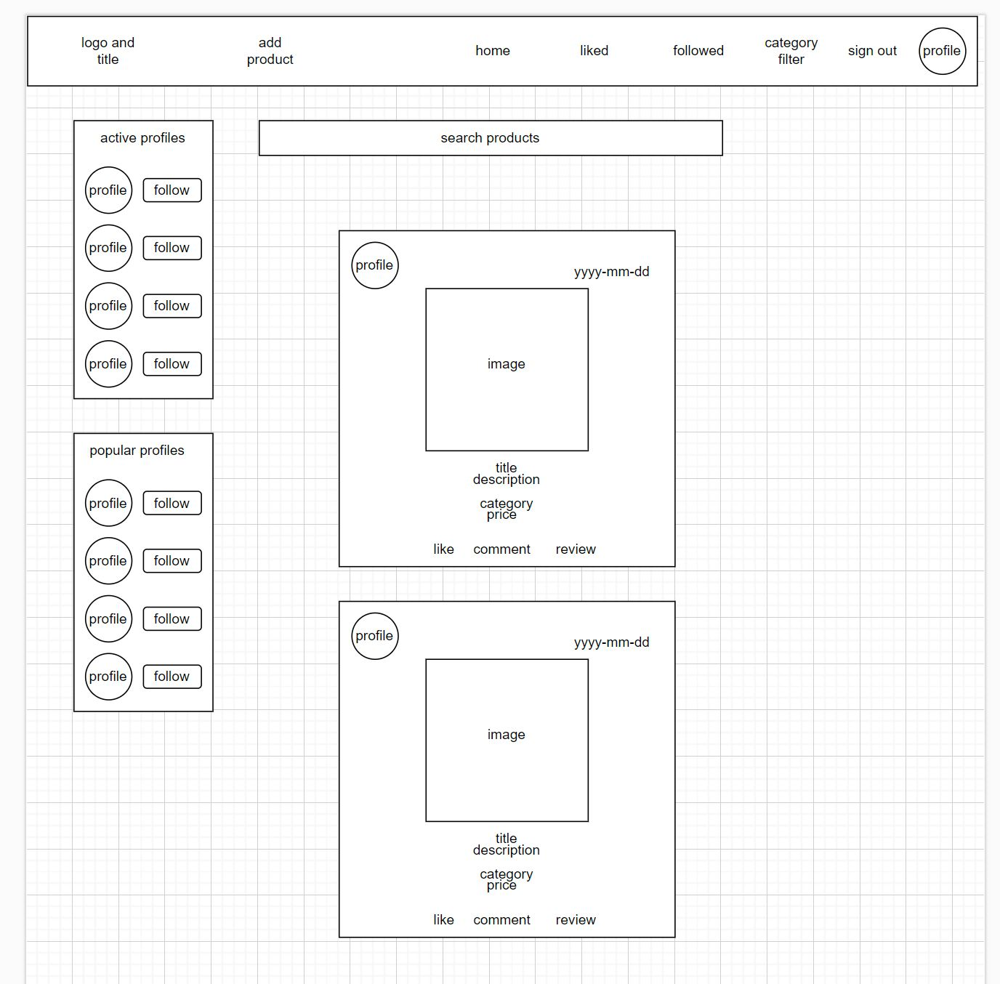

## Category Filter

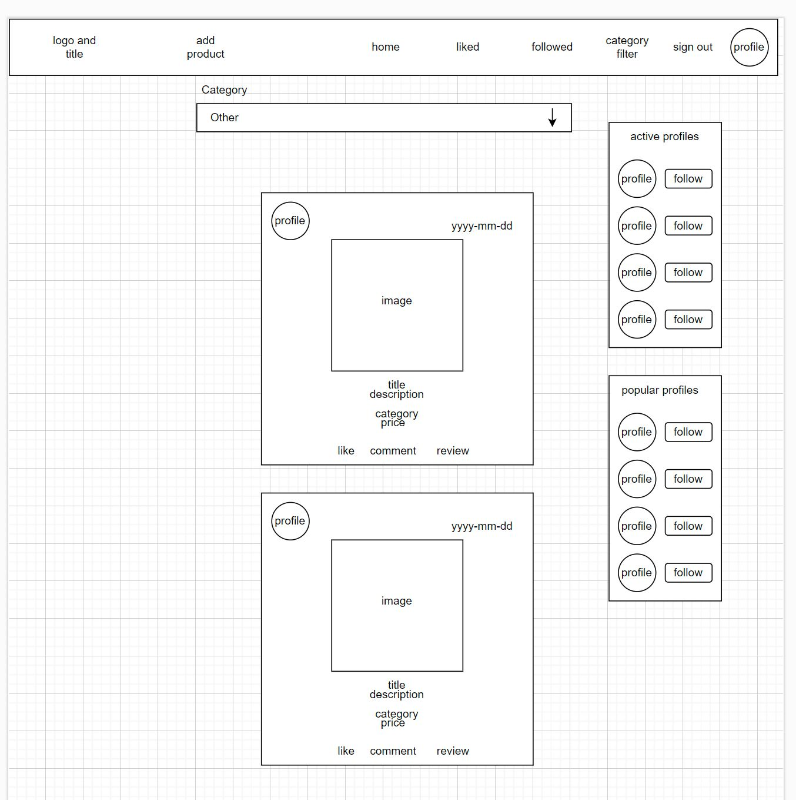

As shown in the wireframes I kept my site consistent in shape and functionality having for home, liked, and followed a search bar on top of the page to search with text the insertions, in a more specific way, first in general, then only liked insertions or followed profiles insertions, in the category filter instead the research can be made by categories

# Project goals

This project is focused on the creation of a marketplace where the user can sell or buy a product, create a first contact with other users regarding the products posted with a comment, leave a like if interested or simply leave a review to show differently than a simple comment the idea about the product shown, the user can route through the different pages, create a product insertion, edit it or delete it, search the product with text research, filter the product by category, see the price of the product and follow another user.
The user is able also to see only the products liked or from the followed user.

# User Stories

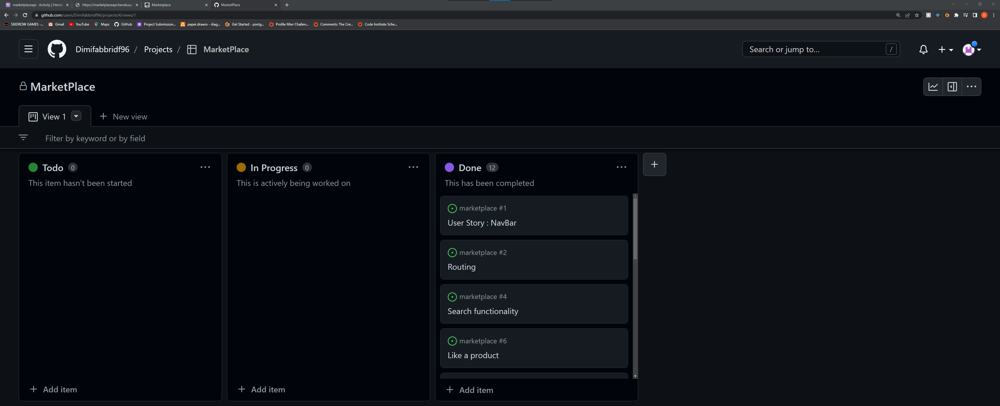

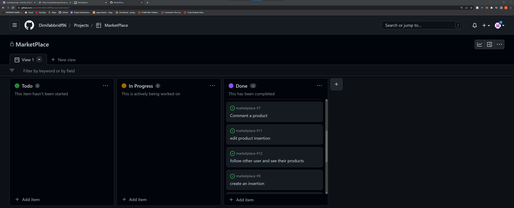

### Creation of a marketplace where the user can sell or buy a product

- create an insertion - As a user, I can create an insertion * so that * I can sell the product I want to sell

### User can create a first contact with the other users regarding the products posted with a comment

- Comment on a product - As a user, I can * comment on an insertion * so that * I can express my idea and have contact with the seller *

### Leave a like

- Like a product - As user I can * Like a product* so that * i can show my appreciation *

### Simply leave a review

- Review - As a user, I can * Leave a review on a product* so that * I can show my idea about it without writing a comment *

### The user can route through the different pages

- User Story: NavBar - As a user, I can * view the navbar from everywhere * so that * I can easily navigate between the pages*

- Routing - As a user, I can route through the pages * so that * I can navigate without refreshing the page

### Edit it

- edit product insertion - As user I can * edit my insertion * so that * I can change some value if I need *

### Delete it

- delete products - As a User, I can * delete the products* so that * I can cancel the products I don't want to sell any more or I sold already *

### Search the product with text research

- Search functionality - As a user, I can * use the search functionality* so that * I can find the product I want by a keyword*

### Filter the product by category

- Filter research - As a user, I can * filter my research* so that * I can find the product that I want in an easier way *

### See the price of the product

- Price is shown - As a user, I can * see the price of the products in the list* so that * I can decide which one is better to buy *

### The user is able also to see only the products liked

- view liked products - As a user, I can * see the products that I liked* so that *I can see if they are still available *

### Followed user

- follow other users and see their products - As a user, I can * follow other users* so that *I can see the new products uploaded *

# Sprints

## 1° sprint

- Create the Navbar
- Import Router to allow change page without refresh
- Create a page for authentication, and registration and work on log-out functionality

## 2° sprint

- Add a creation page form for products
- Create a Page to display the data retrieved from the API added with the form 
- Implement like and unlike functionality

## 3° sprint 

- Add page to display products list
- Implement a Search Bar
- First Infinite scroll to display more product insertions without changing the page

## 4° sprint

- Add a product owner dropdown to edit and delete the component only if the owner
- Implemented comment component with owner dropdown component and infinite scroll
- Implemented comment component with owner dropdown component and infinite scroll

## 5° sprint

- Added Popular profiles component to show the list in order of the more followed profiles
- Added Active profiles component to show the list in order of the more active profiles
- Implemented Profile page with owner dropdown
- Implemented follow and unfollow functionality
- Set up testing

# Manual Testing

- A user can route between all the pages easily just by clicking the icon in the navbar, finding in the first instance only the signup, sign in, and home, and then after sign in also all the other possibilities.
 
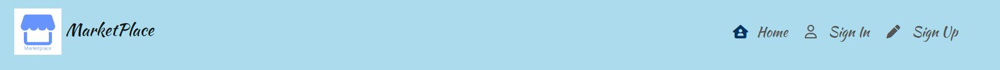    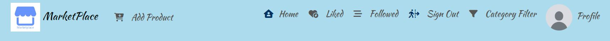

- A user can successfully, sign up, log in and log out without error messages printed in the console or breaking the site.

- A user can update his profile data successfully using appropriate forms provided in a dropdown menu whenever the owner of the profile access it

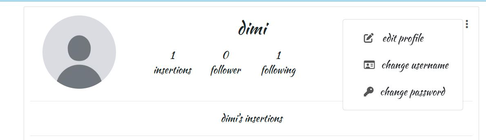

- A user can create a product insertion without issue with a simple and intuitive form that requires to the user a title, description, category, price, and image

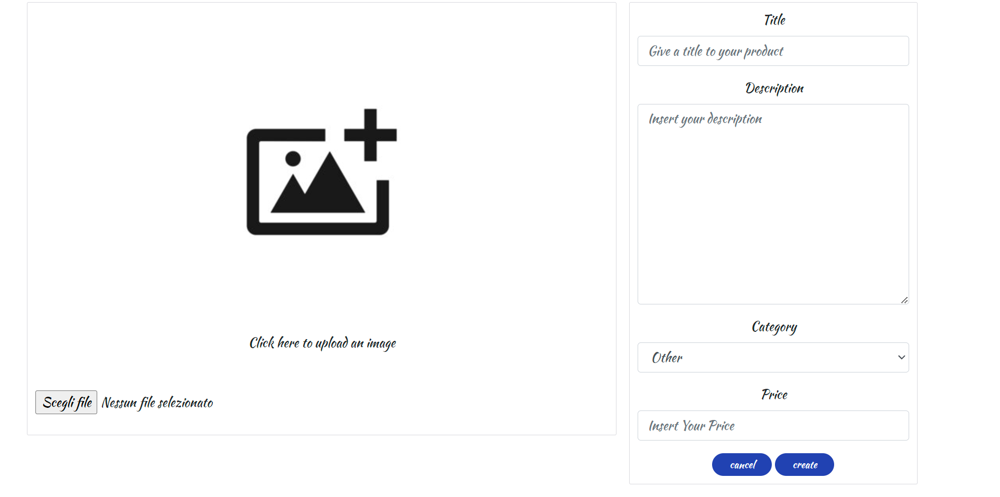

- After the user has posted the insertion other users can comment, leave a like or leave simply a review that is recorded and shows the number of every element on the main products page

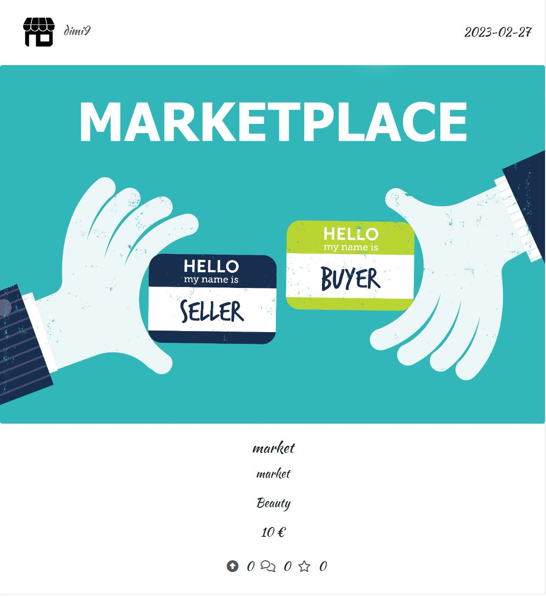

- The user can also find the products using a search bar on the main products page or filter the products by category.

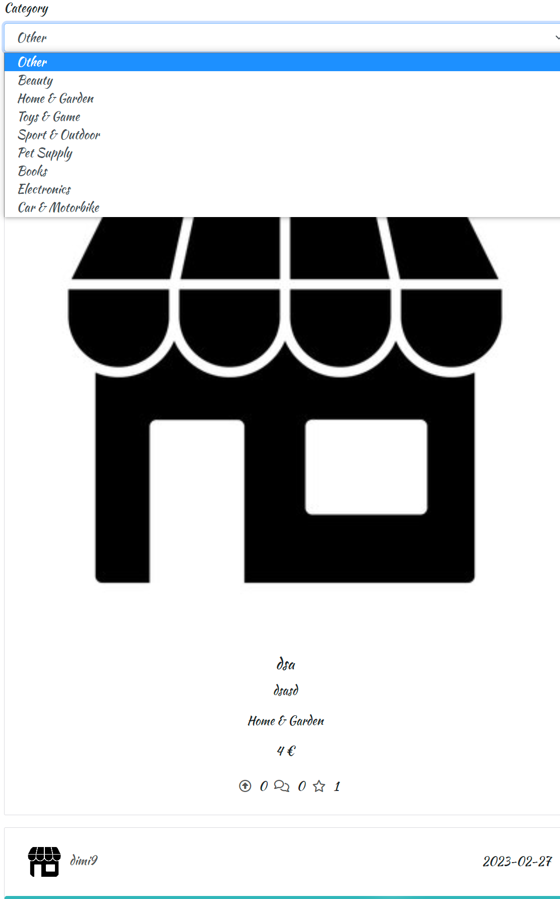

- Always present for the logged-in user on the side of the page is present the popular profiles (profiles with more followers) and the active Profiles (profiles with more insertions)

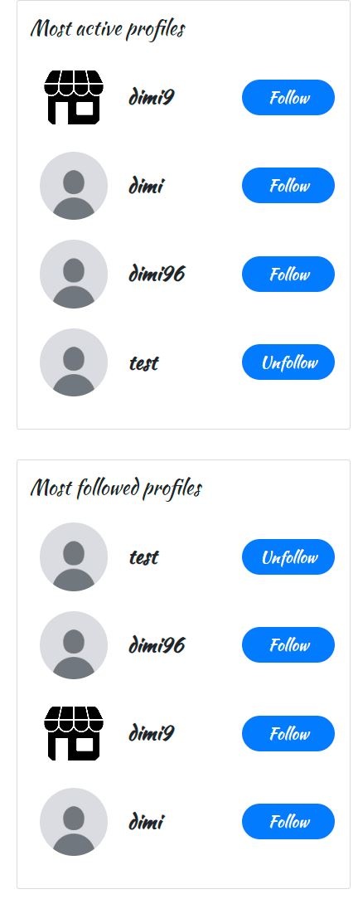

- A User has a dedicated page to see the products liked or the insertions from the profiles that follow.

# LIghthouse Testing

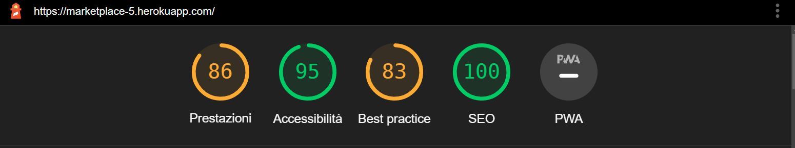

# Reuse of component

As part of the structure, of this site and the use of React the reuse of the component gets very important and after creating a site on my own now I get more focus on this very handy feature of this framework because having this possibility of some piece of code that is repeated in different pages can simply be isolated and use as a component every time need, one example is the CategorySelector component that I create to isolate a form component with label and control to show a list of options to the user in the creation of the product and then reuse in the category filter page to filter the results.
Another component used much time is the Avatar component which contains just a bunch of lines of code but for its importance and wide use comes very handy.
The use of component reusable coming also handier for the versatility that we can give adding different props that can be customized depending on the different cases of use.

# Technologies used

## React Bootstrap
- I choose React Bootstrap for the wide choice of customization and the user-friendliness

## Django Rest Framework
- Framework used to create a database data to work within the Frontend

## ElephantSQL
- Service of database to migrate my data inherit from DRF

### GitHub
- Used to store my repositories

### Gitpod
- Used to work on my workspace and then add, commit, and push on GitHub

### Jwt-decode

- Installed this package to decode the JSON Web Tokens

### Paper.drawio

- Site where I build my wireframes and the flowchart for my backend database organization

# Design

- I choose for this site 2 main colors, one light shade of light blue (#8dc9e1) in the Navbar and a simple white to contrast with the Navbar, the icon are instead a light grey (#555) to give a uniform visual for the user, the active page is recognizable because the icon that represents the page is in a different color (#0000ff), a bright blue simply recognizable.

# Future Feature

- One new feature to add can be the possibility to refine the research by price or many other details like the color of the product 

- One very useful feature can be also the possibility to have direct contact between seller and buyer using direct message chat.

# Bugs

## Solved Bugs

- Solved bug with likes, comments, and reviews count number display, solved keeping consistent my state throughout all the components where this component are displayed

## Remaining Bugs

- At the moment, no new bug discovered

# Deployment

- Create new repositories with Gitpod, give a name to the app (all lowercase in this case for the creation of the ReactApp successfully later on )
- Create a React app using the command: npx create-react-app . --use-npm (the name of the app is going to be the name of your repository)
- Start the app with npm start.
- Opening the preview you should see a React Logo and text, all of this is stored in the App.js.

## Heroku app creation

- Open Heroku and click on New and then Create a new app.
- Insert the name of the app, and the region where we are, and then create app.
- In the deploy tab select GitHub, the repository that you want to use, and then set if you prefer also an automatic deployment every time we push the code.
- Wait until the build and the deployment is complete and then click on Open app to be sure is successfully displayed.

## Final Deployment

- Add, commit, and push all the code
- If the deployment is not automatic make sure to click on manual deployment
- After the deployment clicks on open app to make sure is everything shown as expected.

