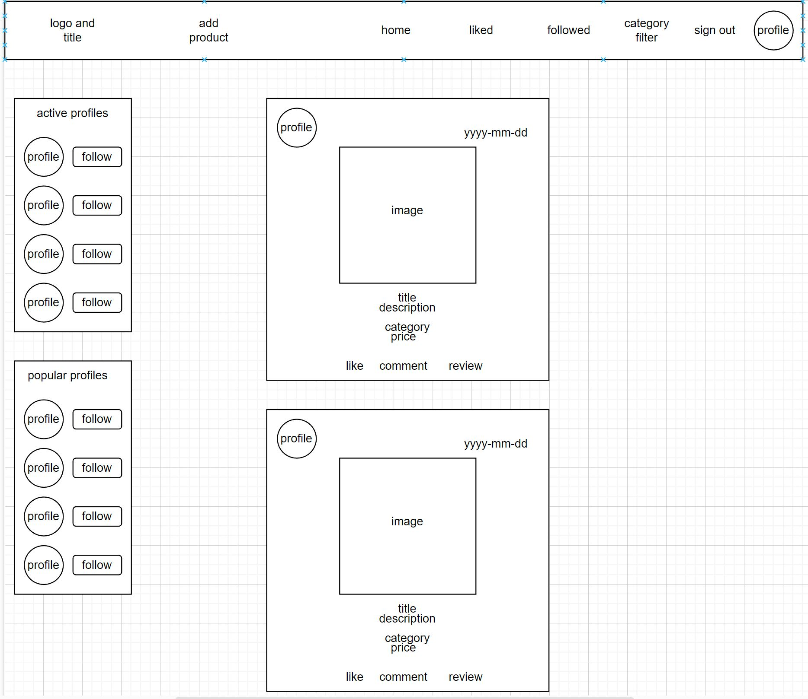

# Marketplace

Marketplace is a site where users can post product insertions and receive feedback from the other user, the main porpouse of this site is put in contact buyer and seller with comments, give the possibility to follow other seller to not lose any new insertion and leave a like to show appreciation !

# Wireframe

# Project goals

This project is focus on the creation of a marketplace where the user can be a sell or buy a product, create a first contact with other users regarding the products posted with a commment, leave a like if interested or simply leave a review to show in a different way than a simple comment the idea about the product shown, the user can route through the different pages, create a product insertion, edit it or delete it, search the product with text research, filter the product by category, see the price of the product and follow other user.
The user is able also to see only the products liked or from followed user.

# User Stories

### Creation of a marketplace where the user can be a sell or buy a product

- create an insertion - As a user I can create an insertion * so that * I can sell the product I want to sell

### User an create a first contact with the other users regarding the products posted with a commment

- Comment a product - As a user I can * comment an insertion * so that * I can express my idea and have a contact with the seller *

### Leave a like

- Like a product - As user I can * Like a product* so that * i can show my appreciation *

### Simply leave a review

- Review - As user I can * Leave a review to a product* so that * i can show my idea about it without write a comment *

### The user can route through the different pages

- User Story : NavBar - As user I can * view the navbar from everywhere * so that * I can easily navigate between the pages*

- Routing - As user I can route through the pages * so that * i can navigate without refresh the page

### Edit it

- edit product insertion - As user I can * edit my insertion * so that * I can change some value if I need *

### Delete it

- delete products - As User I can * delete the products* so that * I can cancel the products I don't want to sell anymore or I sold already *

### Search the product with text research

- Search functionality - As user I can * use the search functionality* so that * I can find the product I want by key word*

### Filter the product by category

- Filter research - As user I can * filter my research* so that * I can find the product that I want in a easier way *

### See the price of the product

- Price shown - As user I can * see the price of the products in the list* so that * I can decide which one is better buy *

### The user is able also to see only the products liked

- view liked products - As user I can * see the products that I liked* so that *I can see if they are still available *

### Followed user

- follow other user and see their products - As user I can * follow other user* so that *I can see the new products uploaded *

# Manual Testing

- A user can route between all the pages easily just clicking the icon in the navbar, find in first instance only the sign up, sign in and home and then after sign in also all the other possibility.
 
    

- A user can succesfully, sign up, log in and log out without error messages printed in the console or break the site.

- A user can update his profile datas succesfully using appropriate forms provided in a dropdown menu whenever the owner of the profile access it

- A user can create a product insertion without issue with a simple and intuitive form that require to the user a title, description, category, price and image

- After the user have post the insertion other user can comment, leave a like or leave simply a review that are record and shown the number of every element in the main products page

- The user can also find the products using a search bar in the main products page or filter the products by category.

- Always present for the logged in user on the side of the page is present the popular profiles (profile with more follow) and the active Profiles (profiles with more insertions)

- A User have a dedicated page to see the products liked or the insertions from the profiles that follow.

# Reuse of component

As part of structure this site and use of React the reuse of the component is get very important and after creating a site on my own now I get more focus on this very handy feauture of this framework because having this possibility some piece of code that is repeat in different pages can simply been isolate and use as a component everytime need, one example is the CategorySelector component that I create to isolate a form component with label and control to show a list of options to the user in the creation of the product and then reuse in the category filter page to filter the results.
Another component used many time is the Avatar component that itself contain just a bunch of line of code but for his importants and wide use comes very handy.
The use of component resuable coming also more handy for the versatility that we can give adding different props that they can be customise depending on the different case of use.

# Technologies used

## React Bootstrap
- I choose React Bootstrap for the wide choice of customisation and the user-friendliness

## Django Rest Framework
- Framework used to create a database data to work with in the Frontend

## ElephantSQL
- Service of database to migrate my data inherit from DRF

### GitHub
- Used to store my repositories

### Gitpod
- Used to work on my workspace and then add, commit and push on GitHub

### Jwt-decode

- Installed this package to decode the JSON Web Tokens

### Paper.drawio

- Site where I build my wireframes and the flowchart for my backend database organization

# Design

- I choose for this site 2 main color, one light shade of lightblue (#8dc9e1) in the Navbar and a simple white to contrast with the Navbar, the icon are instead a light grey (#555) to give a uniform visual for the user, the active page is recognisible because the icon that represent the page is in a different color (#0000ff), a bright blue simply recognisable.

# Future Feauture

- One new feauture to add can be the possibility to refine the research by price or many other details like color of the product 

- One very useful feature can be also the possibility to have a direct contact between seller and buyer using direct message chat.

# Deployment

- Create a new repositeries with Gitpod, give a name to the app (all lowercase in this case for the creation of the ReactApp succesfully later on )
- Create a React app using the command: npx create-react-app . --use-npm (the name of the app is going to be the name of your repository)
- Start the app with : npm start.
- Opening the preview you should see a React Logo and a text, all of this is store in the App.js.

## Heroku app creation

- Open Heroku and click on New and then Create a new app.
- Insert the name of the app, the region where we are and then create app.
- In the deploy tab select GitHub, the repository that you want to use and then set if you prefere also an automatic deployment everytime we push the code.
- Wait until the build and the deployment is complete and then click on Open app to be sure is succesfully displayed.

## Final deployment

- Add, commit and push all the code
- If is not automatic the deployment make sure to click on manual deployment
- After the deployment click on open app to make sure is everything shown as expected.

